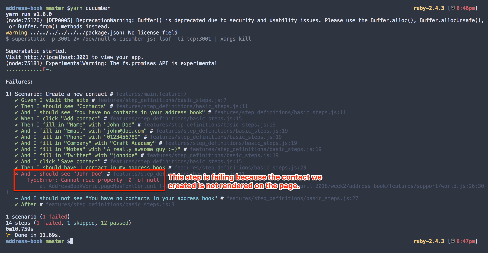

# Render contacts on the page

In the previous section, we managed to store our contact in the browser's local storage when the form was submitted. To complete the implementation of our scenario, we now need to render the contact that was created onto the page.



We need to dynamically load the contact from the local storage, then add some markup on the page for each contact. In your index.html you currently have the following markup



```markup
<div>
  <p>You have no contacts in your address book</p>
</div>
```



We are going to replace that with the following



```markup
<div class="contact-list">
</div>
```



We then need to write some javascript code to read and programmatically modify the content of the `contact-list` div. In the `app.js` file, we'll create a function `renderContact()` that will be responsible for doing what we want here.

Add the following code at the top of your `app.js` file



```javascript
const renderContacts = () => {
  const storage = window.localStorage
  // Read all the contacts from the storage
  const contacts = JSON.parse(storage.getItem('contacts'))
 
  // Select the container we will use to list the contacts 
  let div = document.querySelector('.contact-list')
 
  if (contacts) {
    div.innerHTML = ''
   
    // render the contacts
    const ul = document.createElement('ul')
   
    // For every contact in our array of contacts, we will
    // create a li element that will contain a card with
    // all the information of the contact
    contacts.forEach(contact => {
      let li = document.createElement('li')
      li.innerHTML = `
        <div class="card">
          <div class="image">
            
          </div>
          <div class="content">
            <h1>${ contact.name }</h1>
            <h2>${ contact.company }</h2>
            <p>${ contact.notes }</p> 
            ${ contact.email } | 
            <a href="https://www.twitter.com/${ contact.twitter}">@${contact.twitter}</a>
          </div>
        </div>
     `
      // Add the contact's li to the unordered list we created earlier
      ul.appendChild(li)
    })
    
    // Lastly, append the list to the contact-list container.
    div.appendChild(ul) 
  } else { 
    div.innerHTML = '<p>You have no contacts in your address book</p>' 
  }
}

```



And finally we need to call this function so that the contacts are rendered when we visit the page. Also,  every time we create a new contact we want to call it so that the new contact gets rendered as well.

Let modify our `app.js` file as follow



```javascript
document.addEventListener('DOMContentLoaded', () => {
  renderContacts() // Add this line at the top of this function
  
  ...
  
  storage.setItem('contacts', JSON.stringify([contact]))
  renderContacts() // Add it again after we store the contact
})
```



Running cucumber at this stage, we should see that step go green and the last one pending.

Naturally, if we have some contacts on our list, we should not see a text saying `You have no contacts in your address book` . Let's implement the step definition that will get that to pass. Modify the last pending step in your `basic_steps.js` file with the following code.



```javascript
...
Then('I should not see {string}', async function (content) {
  return await this.pageDoesNotHaveTextContent(content)
})
```



Then in the world.js file we'll implement the pageDoesNotHaveTextContent\(\) helper.

```javascript
class AddressBookWorld {
  ...
  
  async pageDoesNotHaveTextContent(unexpectedContent) {
    const pageContent = await this.page.content()
    let actualContent = pageContent.match(unexpectedContent)
 
    expect(actualContent).to.be.eq(null)
  }
}
```

Similarly to `pageHasTextContent()`, we get the page's content but this time around when we call the `match()` function on it, we expect the result to be `null`, in order words, not visible on the page.

Great, now if we run our entire scenario, all steps should pass.

We've come a long way so far, we're able to create a contact then display it on the page. But, if you start the server now and open the page on your browser, you'll notice that every time you save a contact, it replaces the one that was previously stored. We need to refactor our code so that multiple contacts can be stored. We will do that in the next section.

